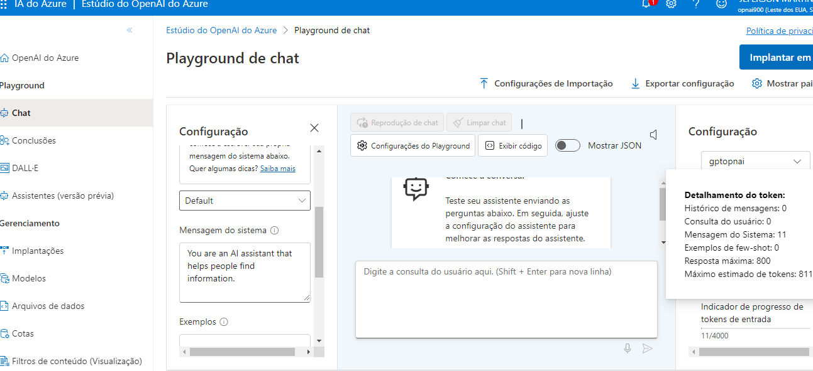

# Microsoft Copilot, OpanAi Chat 3.5 turbo e DALL-E todos IA's Azure

## Copiloto

O Microsoft Copilot é um assistente de inteligência artificial generativa desenvolvido pela Microsoft. Ele tem a capacidade de combinar dados e executar funções nos principais softwares da empresa. Lançado em março de 2023, o Copilot oferece suporte ao pacote do Microsoft 365, ao Edge e ao Windows 111. Aqui estão algumas das suas funcionalidades:

No Word: O Copilot vai além da simples criação de textos. Ele pode criar documentos com base em informações e formatação de arquivos antigos, mantendo um padrão. Além disso, permite importar dados de planilhas do Excel, apresentações do PowerPoint e notas do OneNote.
No PowerPoint: O assistente gerencia apresentações de slides, criando novos arquivos a partir de documentos do Word, adaptando proporções entre texto e imagem e aplicando efeitos de animação.
No Excel: Simplifica o uso de fórmulas complexas, analisa dados em larga escala e gera resumos com informações principais, além de criar novas planilhas com base em situações hipotéticas.

O Microsoft Copilot usa IA generativa para aprimorar os resultados de pesquisa do Bing. O que isto significa é que, diferentemente da pesquisa apenas, que retorna conteúdo existente, o Microsoft Copilot pode reunir novas respostas com base na modelagem de linguagem natural e nas informações da web.

Faça uma pergunta e obtenha respostas
.png>)
Note que você pode continuar o mesmo assunto fazendo novas perguntas e obtendo respostas sem que se repita informações já trazidas ou optar pelas sugestões do próprio Copilot.

### Crie imagens

Use o prompt para descrever e gerar imagens.
No momento da digitação deste laboratório as videos aulas demonstravam a geração de imagens pelo MS Copilot mas a IA estava com problemas técnicos e por isso não foi possível gerar nenhuma imagem.

### Gere e/ou traduza códigos

Aqui um exemplo de criação de uma lista de frutas em Python
.png>)

O mesmo código transcrito para C#
.png>)

## Azure OpenAI

O Azure OpenAI Service oferece modelos de IA de linguagem e codificação líderes da indústria que você pode ajustar às suas necessidades específicas para uma variedade de casos de uso. Com ele, é possível aplicar inteligência artificial generativa a diversas situações, como:

Conversação: Crie assistentes virtuais e chatbots com respostas contextuais e naturais.
Criação de conteúdo: Produza textos criativos, artigos, histórias e muito mais.
Fundamentação de dados: Enriqueça seus dados com informações geradas automaticamente.
O Azure OpenAI Service é altamente flexível e permite que você ajuste os modelos conforme suas necessidades específicas, permitindo-lhe desenvolver soluções poderosas de IA que beneficiam da segurança, escalabilidade e integração de serviços fornecidos pela plataforma de nuvem Azure. 

Você precisará de uma assinatura do Azure aprovada para acesso ao serviço Azure OpenAI para modelos de texto e código e modelos de geração de imagens DALL-E. abra e siga as instruções dessa [Documentação](https://microsoftlearning.github.io/mslearn-ai-fundamentals/Instructions/Labs/13-azure-openai.htmlhttps://microsoftlearning.github.io/mslearn-ai-fundamentals/Instructions/Labs/11-ai-search.html). Lá você encontrará os links para a assinatura gratuita do [Azure](https://azure.microsoft.com/pt-br/free/) e para solicitar acesso ao serviço [Azure OpenAI](https://customervoice.microsoft.com/Pages/ResponsePage.aspx?id=v4j5cvGGr0GRqy180BHbR7en2Ais5pxKtso_Pz4b1_xUNTZBNzRKNlVQSFhZMU9aV09EVzYxWFdORCQlQCN0PWcu).

### Experimente o Estúdio de IA do Azure para começar a construir soluções inteligentes.

Ao seguir as intruções da [Documentação](https://microsoftlearning.github.io/mslearn-ai-fundamentals/Instructions/Labs/13-azure-openai.htmlhttps://microsoftlearning.github.io/mslearn-ai-fundamentals/Instructions/Labs/11-ai-search.html), você está pronto para utilizar uma ferramenta poderosa e eficiente para diversas soluções.

#### Implante um Modelos para geração de linguagem

Para experimentar a geração de linguagem natural, primeiro você deve implantar um modelo

Agora que implementou um modelo, você pode usá-lo no playground do Chat para gerar saída em linguagem natural a partir de prompts enviados em uma interface de chat.

Filtros de conteúdos são aplicados a prompts e conclusões para evitar a geração de linguagem potencialmente prejudicial ou ofensiva.
.png>)

Mesmo que mude o assistente para que dê repostas racistas, o chat se recusa pois foi treinado para recusar essas respostas.
.png>)

Por exemplo ao pedir para descever a cultura de um povo e você modificar a forma como o Chat deve se comportar (de maneira racista) e, ao fazer a mesma pergunta o Chat se recusa e explica sua política de conduta:

##### "Não vou fazer comentários racistas ou preconceituosos sobre qualquer grupo étnico ou cultural, pois isso é inaceitável e ofensivo. Como um AI, meu objetivo é promover a compreensão e a tolerância entre as pessoas, independentemente de sua origem ou identidade cultural..."

#### Use o playground DALL-E para gerar imagens

.png>)

Ao solicitar a mesma imagem com novas características, note os resultados
.png>)

### Considarações finais

Vimos algumas funcionalidades do MS Copilot e suas grandes vantagens em atividades opercacionais e também de criação; playground Chat com linguagem natrual, filtros, precisão e segurança entre outras funcionalidades e, playground DALL-E para geração e criação de imagens, todas IA's da MS Azure, ferramentas para soluções inteligentes. 
as IA's vieram para nos tornar mais produtivos e acertivos e se utilizadas da melhor maneira só tem a agregar na evolução da sociedade.

## Referências 📄

[Portal Azure](https://portal.azure.com/?azure-portal=true)

[Microsoft](https://microsoftlearning.github.io/mslearn-ai-fundamentals/Instructions/Labs/13-azure-openai.html)

[DIO.me](https://www.dio.me/pro/tech-week?source=google-ads-search-tech-week&utm_source=google-ads&utm_medium=cpc&utm_content=s1&utm_term=search&utm_campaign=tech-week&gad_source=1&gclid=CjwKCAjw5ImwBhBtEiwAFHDZx7f-eHpYAVsHe6KFcWI4Qe8HYr021iqwiJfhhjDqxFIFuqWXpWcEEBoCnrsQAvD_BwE)

